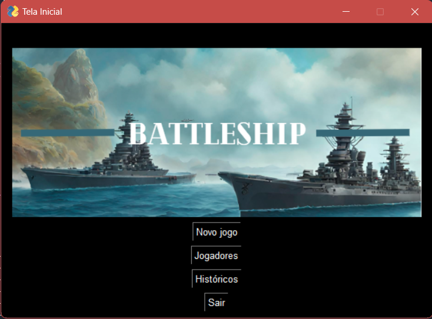
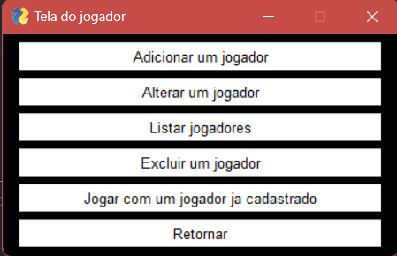
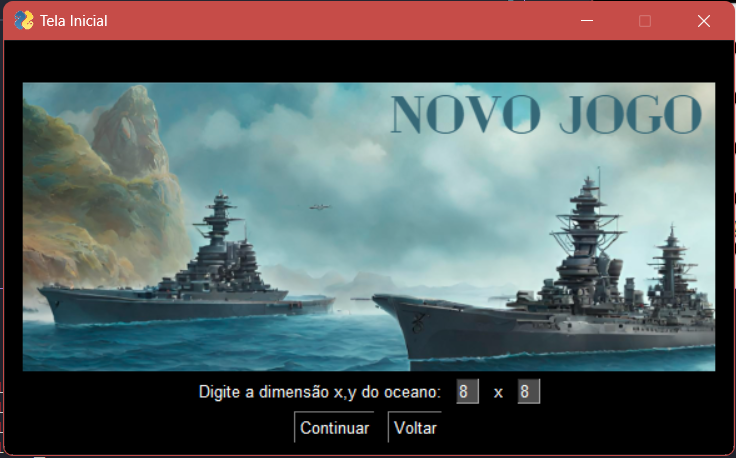
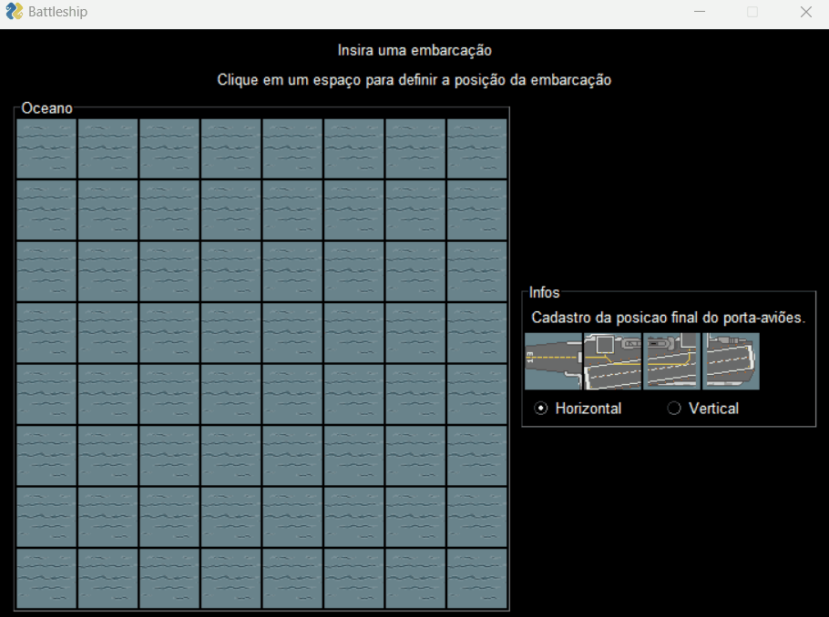

# battleship_game_dev

Desenvolvimento de um jogo de batalha naval, utilizando programação orientada a objetos com o pattern MVC

---

A aplicação faz uso de uma persistência local para armazenar jogadores e o histórico de partidas dos jogadores, assim como as suas pontuações.

Para jogar abra o terminal na pasta raiz do jogo e execute o seguinte comando:

```
    python main.py
```

<h2>Início</h2>



Navega pelas opções:

-   Novo jogo: Cria um novo jogo
-   Jogadores: Direciona para o cadastro de jogadores
-   Históricos: Lista o histórico de todos os jogadores

<h2>Fluxo de jogadores</h2>



<h2>Cadastro da dimensão do oceano para o jogo:</h2>



-   Digite a dimensão do oceano para começar a cadastrar as suas embarcações



<h2>Jogando uma partida</h2>


